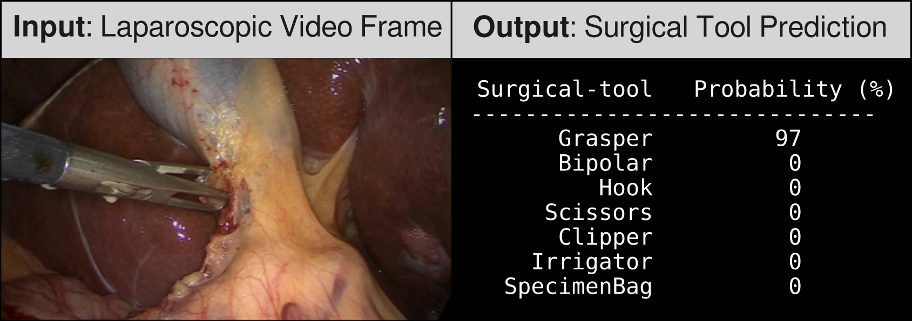

# GFz-Tool
GFz-Tool implements a gradual freezing fine-tuning approach designed for surgical tool presence detection in laparoscopic videos.
<div style="text-align: center;">

</div>


## Repository Contents

This repository contains model checkpoints, test code and sample images for evaluating model performance and conducting inference on laparoscopic video frames.

## Model Checkpoint

This repository offers two ResNet50-based checkpoints, fine-tuned on different Cholec80 dataset splits to predict seven surgical tool classes.

- `GFz-L_L30.pth`: Fine-tuned using the L30 dataset split.
- `GFz-L_L40.pth`: Fine-tuned using the L40 dataset split.

### Dataset
The model checkpoints included in this repository were fine-tuned on the Cholec80 dataset. For a detailed overview of the dataset, refer to [this page](https://camma.unistra.fr/datasets/).

## Test Code

The `src/` directory contains code to verify model functionality and performance.

### Running Tests

```bash
# Example command to run tests
python src/gfz_tool.py --checkpoint checkpoints/GFz-L_L40.pt --image image/image1.png
```

## Requirements

You can install the required packages using:
```bash
conda env create -f requirements.yml
conda activate gfz
```

## License

This benchmark suite is licensed under the GNU General Public License v3.0 (GPLv3).